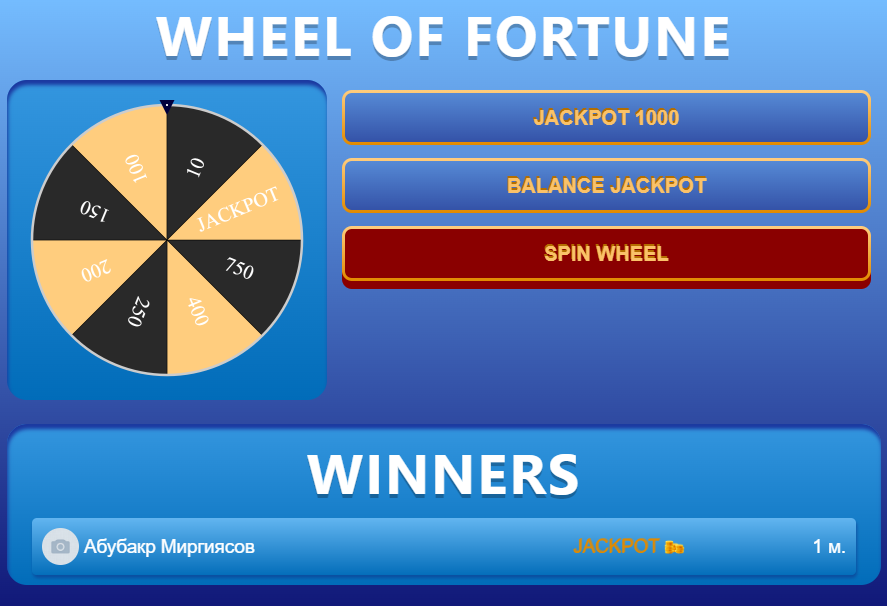

# Wheel of Fortune 2

Wheel of Fortune - это веб-приложение, разработанное с использованием React для клиентской части и Node.js с Express для серверной части. Этот проект представляет собой игру "Колесо Фортуны".





## Особенности

- Интерактивная игра "Колесо Фортуны".
- Клиентская часть на React с использованием современных веб-технологий.
- Сервер на Node.js с Express для обработки игровой логики и запросов от клиента.
- Развернуто в VK Mini Apps.

## Требования

- Node.js (версия 16 и более)
- NPM (версия 9 и более)

## Установка

1. Клонируйте репозиторий:

```bash
git clone https://github.com/abubakrmirgiyasov/WheelOfFortune.git
cd ./client
npm start
npm run tunnel
cd ./server
npm start